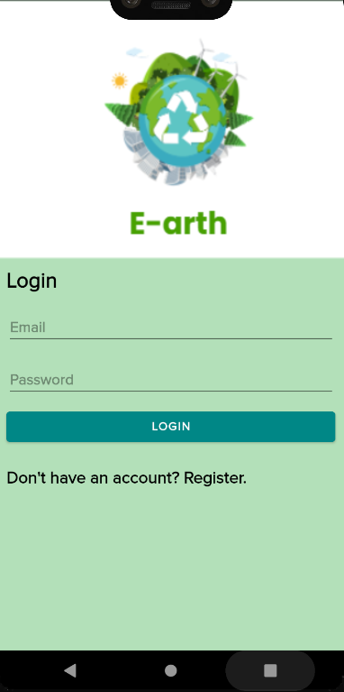
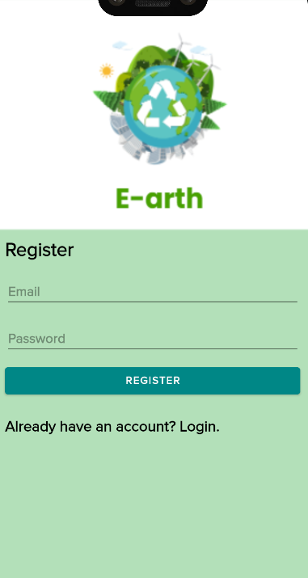
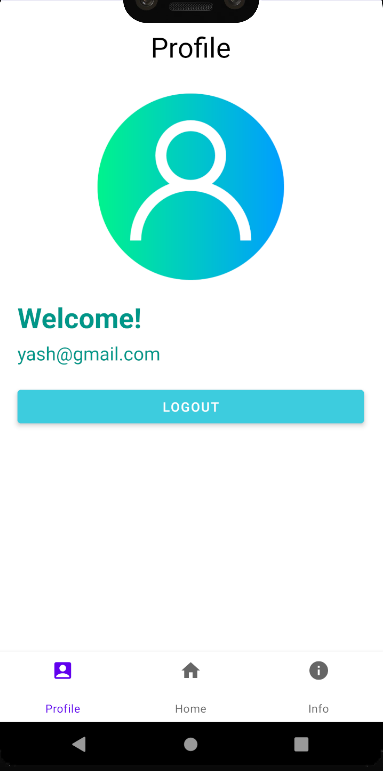
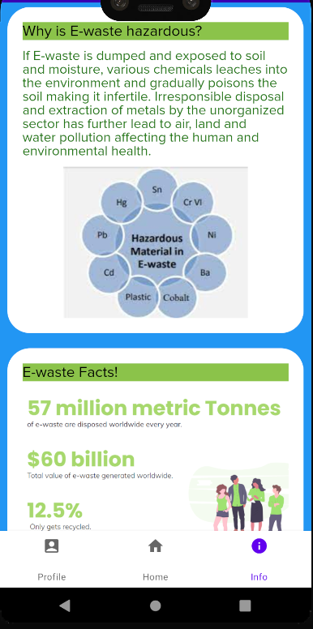
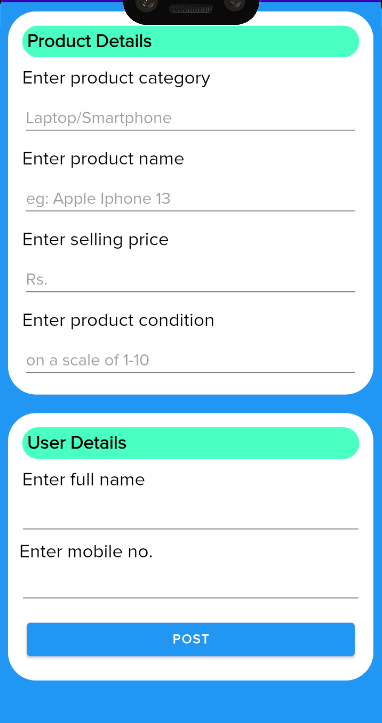
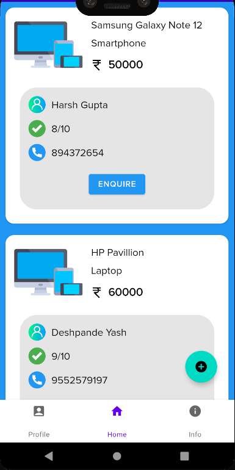
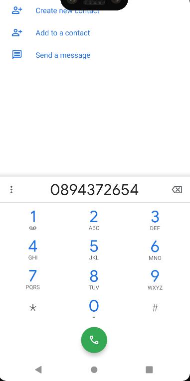

# E-arth App - Buy and Sell e-waste 🌎

## Description 🗒️
Conceptualized an Android App which provides an e-commerce platform to the users to buy and sell their e-waste products like Smartphones and Laptops, 
and educates the users about the importance of recycling e-waste ♻️

## UI ✨

### Login Activity

### Register Activity

### Profile Fragment

### Info Fragment

### Create Post Activity

### Buy Fragment

### When user clicks on 'Enquire' button in Buy Fragment

## Tech stack 👨‍💻
Kotlin, XML.

## Tool 📱
Android Studio
